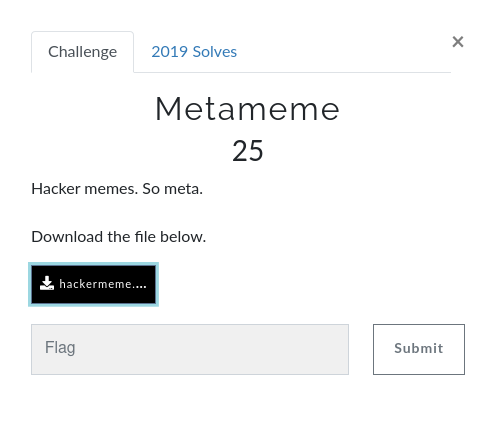

# Nahamcon-ctf-writeups
The write-ups for Nahamcon-ctf :: Power of grep
As most write-ups are already there, this write-up only has chals that can be solved via grep. 
_Also this is the first time I am doing write-ups so let see how it goes.._

### Challenges

- #### Warm up challenges
    ___
    #### Clisays
    

    ##### Solution
    
         
    1. Figuring out the type of file using file command, it is an ELF binary
    2. `Strings clisays | grep-i "flag{"` checks whether the binary has hardcoded string like flag, seems it has one, but we were unable to find full flag
    3. `Strings clisays | grep-i "flag{" -A 10` this prints the next 10 lines after the matched string and we got out flag
    
    > flag{Y0u_c4n_r3Ad_M1nd5}
    
    ___
 
    #### MetaMene
    

    ##### Solution
    
         
    1. Figuring out the type of file using file command, it is an JPEG file
    2. `Strings hackerman.jpeg | grep-i "flag{.*}"` okay so this command looks for regular expression `flag{.*}` in the strings from png image and seems like we got our flag
    3. This challenge was actually about metadata so propersol would be `exiftool hackerman.png`, but it's a ctf and this write-up is about power of grep.
    
    > flag{N0t_7h3_4cTuaL_Cr3At0r}
    
    ---

- #### Forensics challenges
    ___
    #### Microsooft
    

    ##### Solution
    
    
         
    1. Figuring out the type of file using file command.
    2. `binwalk -e microsooft.docx"` extracts the data(sub files) from the file.
    3. Navigate into the extracted folder.
    4. `grep -r -i "flag{.*} .` recursively checks all file in the present directory for the flag.
    
    > flag{oof_is_right_why_gfxdata_though}
    
    ___
    #### Cowpie
    

    ##### Solution
    
         
    1. Figuring out the type of file using file command.
    2. `strings manure | grep -i "flag{.*}` woaw pretty easy right.
    3. Alright so it was an unintended way to solve the challenge, but the reason I am showing this way of doing it shows, even ctf creators who are concerned about chal sometimes leave some hard-coded values, now just think about what you can find in real world ;)
    
    > flag{this_flag_says_mooo_what_say_you}
    
    ___

- #### Mobile challenges
    ___
    #### Candroid
    

    ##### Solution
    
    
         
    1. `apktool d candroid.apk` decodes the apk file and puts the decoded content into a folder with name similar to apk name in the current directory.
    2. `grep -r -i "flag{.*} ."` greps the flag from the current folder
    3. Again the challenge was about analysing the apk but if you know grep, and little apk reversing tricks you can use the above grep trick for much more, check out the apk reversing room on THM for more
    
    > flag{4ndr0id_1s_3asy}
    
    ___
    #### Simple App
    
    

    ##### Solution
    
    
    
  
    1. `apktool d simple-app.apk` decodes the apk file and puts the decoded content into a folder with name similar to apk name in the current directory.
    2. `grep -r -i "flag{.*} ."` greps the flag from the current folder
    3. Similar to previous chal.. huh, nope, this time the hardcoded string was in smali, that is _like_ the assembly language for android.
    
    > flag{3asY_4ndr0id_r3vers1ng}

    > Even the third Mobile chal flags can be find this way but it would be encrypted so you would have to actually jadx-gui or dex2jar+jd-gui to rev engineer the app to figure out the how to decrypt the flag.
    
    ___

- #### Miscellaneous challenges
    ___
    #### Vortex
    

    ##### Solution
    
         
    1. A classic Grep challenge
    2. `nc jh2i.com 50017 | strings | grep -i "flag{.*}"` greps the flag from input stream after extracting the strings, took me around 10-15 sec to get the flag.
    
    > flag{more_text_in_the_vortex}
    
    ___
    #### Fake File
    

    ##### Solution
    
    
    1. Connected to the server, tried to cat the file but as the file name is equal to `..` it results in an error, that bash thinks it is a directory.
    2. Ah haan so i can't cat it, guess i will just grep what i need `grep -r -i "flag{.*}" .`
    3. Yet again, it is just the checky way to get the flag, remember this whole walkthrough is about power of grep in ctfs.
    4. Also check this write-up, how smarty Emile used grep to dump all flags from hard disk, but he reported it _Thanks to him for not ruining the CTF for everyone_. <3
    https://tildeho.me/leaking-all-flags-in-a-ctf/
    
    > flag{we_should_have_been_worried_about_u2k_not_y2k}
    
    ___

#### Summary

These write-ups were all about the power of grep, and it is not the intentional way to get flag in ctfs as the main purpose of CTF's is to learn but, hey we are h4ck0rs, right ;) 
`grep` in the hands of 1337 is one of the most powerfull command ever.

> grep -r -i "flag{.*}" .

Thanks for reading.. . .

But hey, here is a bonus section of OSINT chals ;)

- #### OSINT challenges
    ___
    #### Time Keeper
    

    ##### Solution
    1. Opening the original wepage, checked the source code, there was a username there which lead to a twitter account but that was a rabit hole.
    
  
    2. As the challege said Time-Keeper it was a indirect hint that we need to use wayback machine
    
    
    3. Opening the snapshot of 13th April we get a webpage which give us hint were the flag is.. . .
    
    
    4. Changing the URL to `https://apporima.com/flag.txt` for that snapshot
    
    
    5.  Flag... . .
    
    
    > JCTF{the_wayback_machine}
    
    ___
    #### New Year Resolution
    

    ##### Solution
    
    
    1. Using `nslookup`
    2. set type=ANY, it will check any/all details.
    3. Flag... . .
    
    > flag{next_year_i_wont_use_spf}
    
    ___
    #### Finsta
    

    ##### Solution
    
        
    1. Challenge Name is the biggest hint, Insta..
    2. searching the username on Instagram..
    3. Flag... . .
    
    > flag{i_feel_like_that_was_too_easy}
    
    You guys know what event that fake account has more followers than i do :( 
    lol.. 
    
    ___
    #### Tron
    

    ##### Solution
    1. Being honest this chal took me a lot of time to figure out as i was thinking it is about shodan.. .
    
  
    2. Thanks for the Nudge CuddleDeath
    3. well, Cuddle asked where else can i find this user... O.o
    4. Used sherlock, found username Nahamcontron on github, and one of the repo commits had an ssh key.
    

    5. Used the ssh key and got the flag <3
   
    > flag{nahamcontron_is_on_the_grid}
    
    ___

#### Thanks for reading <3
#### by team - ChadSec 
